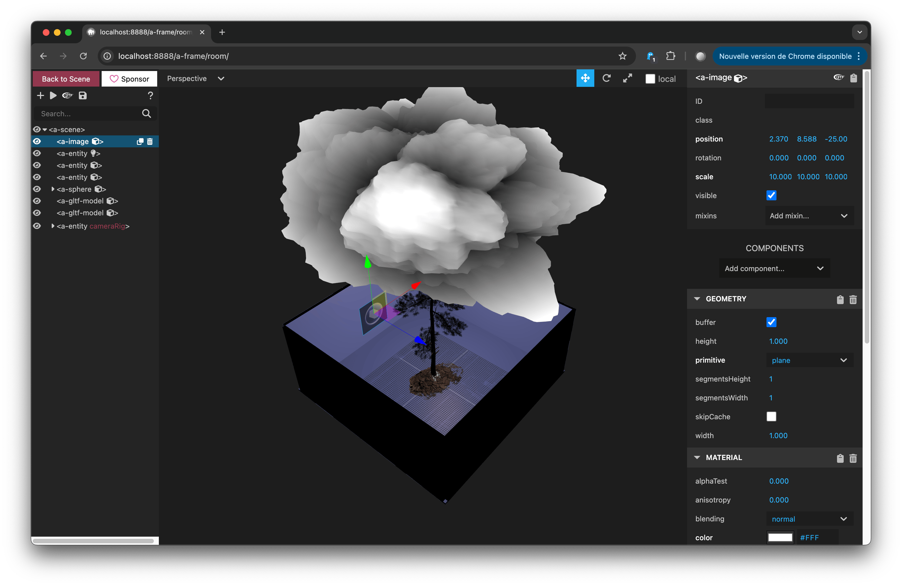

# First scene


## Setup your first scene

In a new `index.html` add:

``` { .html .copy linenums="1"}
<!DOCTYPE html>
<html lang="en">
  <head>
    <meta charset="UTF-8" />
    <meta name="viewport" content="width=device-width, initial-scale=1.0" />
    <title>A-Frame first scene</title>
    <script src="https://aframe.io/releases/1.7.1/aframe.min.js"></script>
  </head>
  <body>
    <a-scene>

    <!-- Primitive shapes -->
      <a-box position="-1 0.5 -3" rotation="0 45 0" color="#4CC3D9"></a-box>
      <a-sphere position="0 1.25 -5" radius="1.25" color="#EF2D5E"></a-sphere>
      <a-cylinder position="1 0.75 -3" radius="0.5" height="1.5" color="#FFC65D"></a-cylinder>
      <a-plane position="0 0 -4" rotation="-90 0 0" width="4" height="4" color="#7BC8A4"></a-plane>

      <!--add a sky to your scene-->
      <a-sky color="#ECECEC"></a-sky>
      
    </a-scene>
  </body>
</html>
```


## Reminder of coordinates for the position of elements 

| Axis | Description                                               | Default Value |
| ---- | --------------------------------------------------------- | ------------- |
| x    | Negative X axis extends down. Positive X Axis extends up. | 0             |
| y    | Negative Y axis extends down. Positive Y Axis extends up. | 0             |
| z    | Negative Z axis extends in. Positive Z Axis extends out.  | 0             |


```
<!-- x y z -->
<a-entity position="0 1 -1"></a-entity>
```

## A-Frame inspector

The Inspector’s scene graph is a tree-based representation of the scene.

{==

On the page (local or online), it is easier to use the [A-Frame inspector](https://aframe.io/docs/1.7.0/introduction/visual-inspector-and-dev-tools.html) to move and enlarge elements, add materials, and more. To do this, press the following keys: control + option + i on the page.

==}

