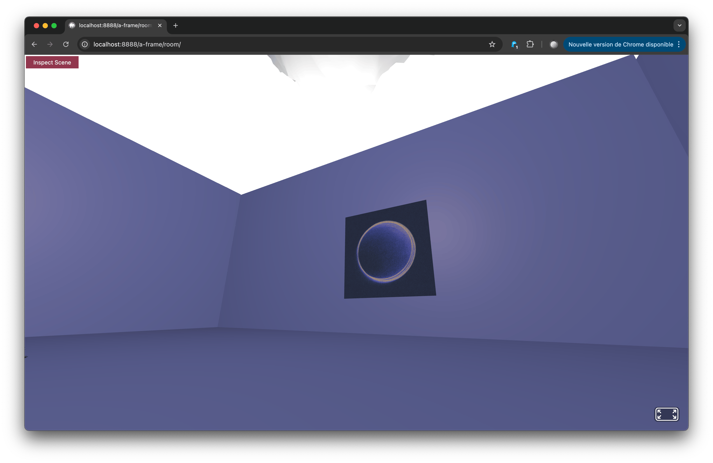

# Add images & 3D models

## Add an image

The image is displayed on a flat plane in the scene.

[Link in the A-Frame doc](https://aframe.io/docs/1.7.0/primitives/a-image.html#main)

<figure markdown="span">

<figcaption>Example of a flat plane display on the wall</figcaption>
</figure>


??? code
    ``` { .html .copy linenums="1"}
    <a-assets>
        
    </a-assets>
    <a-image src="#my-image"></a-image>
    ```

## Add a 3D model

Prepare a 3D model in .glb format using Blender.


[Download a 3D model in glb format](models/tree.glb){ .md-button }

{==

You must use [MAMP](https://www.mamp.info/en/windows/) (locally) to be able to load the 3D file into the page (Cross-Origin Resource Sharing - CORS).

==}


??? code
    ``` { .html .copy linenums="1"}
    <!DOCTYPE html>
    <html>
    <head>
        <meta charset="utf-8">
        <title>3D Model (glTF)</title>
        <meta name="description" content="3D Model (glTF) — A-Frame">
            <script src="https://aframe.io/releases/1.7.1/aframe.min.js"></script>
    </head>
    <body>
        <a-scene background="color: #ECECEC">
        <a-assets>
            <a-asset-item id="tree" src="/tree.glb"></a-asset-item><!-- changer le lien vers le fichier glb -->
        </a-assets>

        <a-gltf-model src="#tree" rotation="0 45 0"></a-gltf-model>
        <a-entity position="0 0 4"><!-- permet déplacer l'objet 3D sur les axes X,Y,Z -->
            <a-camera></a-camera>
        </a-entity>
        </a-scene>
    </body>
    </html>

    ```

